# 官方客户端控件详见图册

本图册供人类查阅，图片来自米哈游客户端控件官方“详见”页面的公开 CDN。AI 查询请优先读 [`docs/15_官方详见页面与图片文字记录.md`](../docs/15_官方详见页面与图片文字记录.md)；这里不要求 AI 逐张读图。

抓取日期：2026-09-25。官方来源与权利边界见 [`REFERENCES.md`](../REFERENCES.md) 和 [`LICENSE.md`](../LICENSE.md)。本地文件只保留官方图片的离线阅读副本，不代表获得第三方素材的再授权。

## 图册索引

- [1. 客户端控件容器](#detail-1)（mhlz2lrly3dq）
- [2. 容器节点控件](#detail-2)（mh3qqq9xc102）
- [3. 文本框界面控件](#detail-3)（mhnltrr3g966）
- [4. 文本视窗控件](#detail-4)（mhv38jig94kk）
- [5. 图片控件](#detail-5)（mh2oih9jou22）
- [6. 界面动效控件](#detail-6)（mh2iyk9fa4gy）
- [7. 全屏界面动效控件](#detail-7)（mhbn4i09l5ns）
- [8. 预设按钮控件](#detail-8)（mhdbkf04v6y8）
- [9. 按键提示](#detail-9)（mh265urgupye）
- [10. 光标检测区域控件](#detail-10)（mhd4fxr5v6la）
- [11. 网格视窗](#detail-11)（mhfkrr0i7gds）
- [12. 模板引用控件](#detail-12)（mhucb6reudwm）

## 1. 客户端控件容器

官方页面：<https://act.mihoyo.com/ys/ugc/tutorial/detail/mhlz2lrly3dq>

容器用于让客户端控件在关卡运行时正常显示；界面没有容器时，所有客户端控件及挂载脚本都不运行。编辑流程为“添加界面控件模板-客户端控件容器”→选中容器“画布设置-前往编辑”→在详情中点“添加控件”。

### 官方截图

> `bfdf8d74-fd35-4cc4-8ad2-9a42921f41cc.png`：标题图，容器图标和文字“客户端控件容器”。

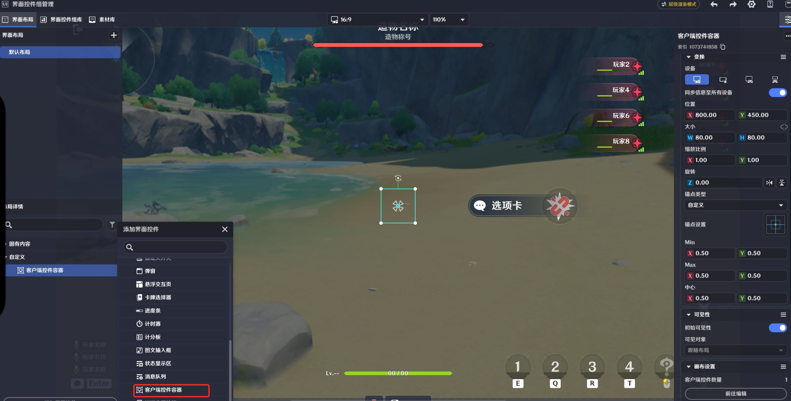
> `6b1c8e1e-61e5-4ca5-8714-e38c35c7e042.jpg`：界面布局编辑器；左侧选中客户端控件容器，中央为游戏画布，右侧为变换、可见性和容器设置，底部有“前往编辑”。

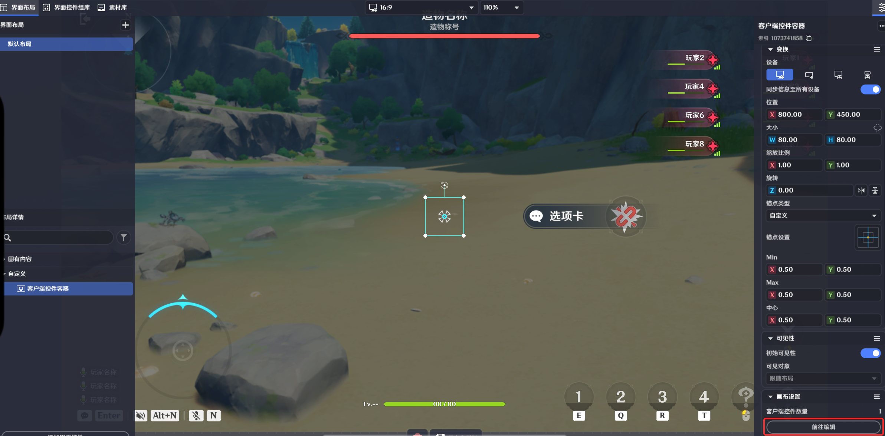
> `fd0a7f11-60e2-4e6e-bd2d-acfb293ce8b7.jpg`：进入容器详情后的编辑器画面，展示容器画布和右侧属性面板。

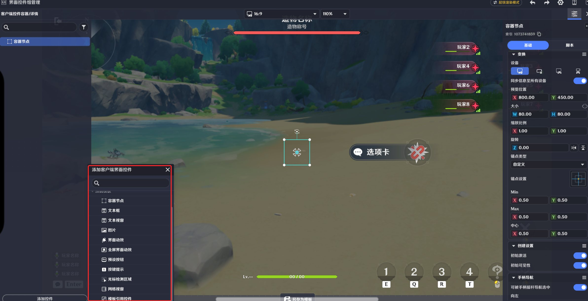
> `f1bd3af0-5864-410a-840c-6dcc87dcf6b7.jpg`：容器详情的“添加控件”操作/控件列表。

## 2. 容器节点控件

官方页面：<https://act.mihoyo.com/ys/ugc/tutorial/detail/mh3qqq9xc102>

容器节点是其他客户端控件的挂点，也可常驻光标、屏蔽按键穿透和点击穿透；脚本接口名 `ClientUIContainerControl`。配置包括“隔离手柄导航”“屏蔽按键事件穿透”“屏蔽区域内光标事件穿透”“显示常驻光标”，另有手柄导航目标。

### 官方截图

> `2c738ac8-99d7-4276-b809-f700d078afcb.png`：标题图，方框图标和“容器节点”。

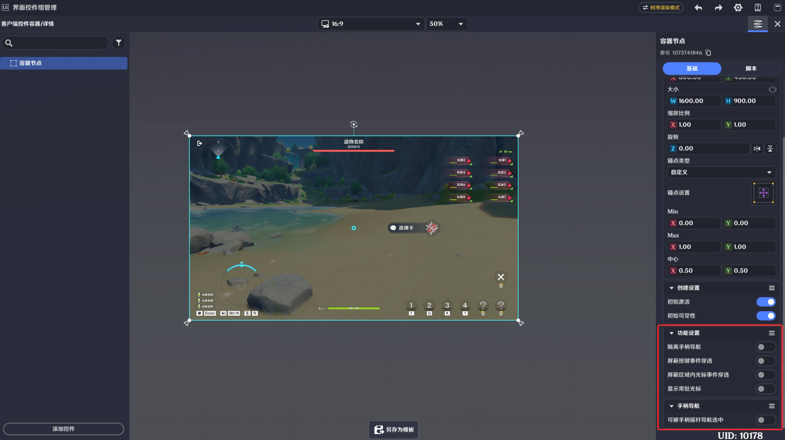
> `e23de4f3-6d66-48f8-bbc9-a1af48ee5be7.jpg`：容器节点属性面板；可见字段为四个功能开关及界面画布。

> `a7da7d77-051d-4136-963d-7d067cf47353.png`：手柄导航面板，含“可被手柄摇杆导航选中”、向左/右/上/下的“距离最近的控件”选择框。

## 3. 文本框界面控件

官方页面：<https://act.mihoyo.com/ys/ugc/tutorial/detail/mhnltrr3g966>

文本框显示预先编辑的文本；自定义变量变化会实时更新。设置有背景颜色（无/黑色半透明）、字号、文本内容和六种对齐方式。变量富文本格式为 `{类型:前缀.变量名}`，类型固定为 `1`；前缀 `p1`~`p8` 表示玩家、`lv` 表示关卡实体、`ps` 表示玩家自身实体，例如 `{1:p4.测试2}`。客户端文本框脚本接口名 `ClientUITextBoxControl`。

### 官方截图

> `6eb7b309-a986-4803-b06d-0d9021e06db6.png`：标题图，T 图标和“文本框”。

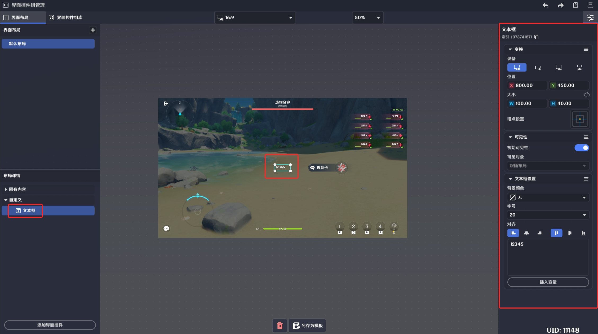
> `8bc744ed-2c89-484e-a6de-8358948f5c86.jpg`：界面布局编辑器中选中文本框的完整属性面板，显示索引、位置/大小、可见性、背景颜色、字号、对齐和文本区域。

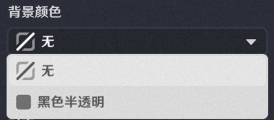
> `62c30aac-d679-4a2d-8e45-afc7f27cd65e.png`：背景颜色下拉框，选项“无”“黑色半透明”。

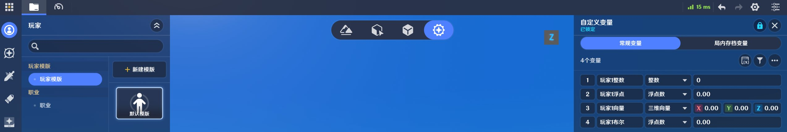
> `55c1853a-d32d-4621-9ee8-bb1c86a0d580.jpg`：文本框内容编辑/插入变量相关界面。

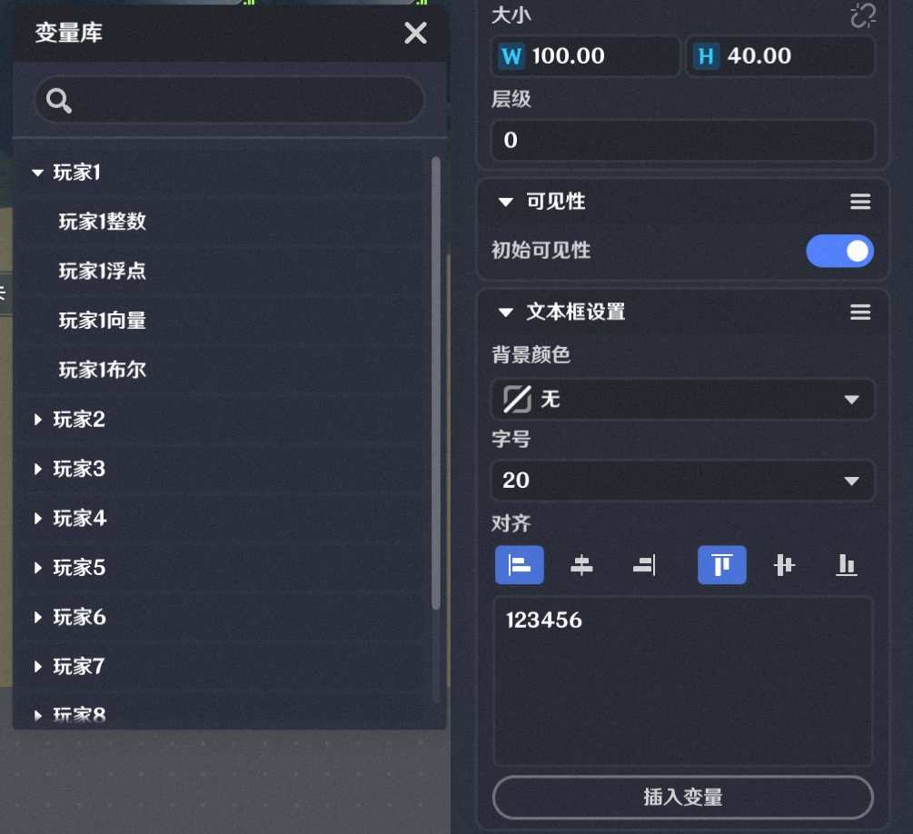
> `e45ec2a2-018c-4d44-9324-f028b645b61f.jpg`：变量库列表，按“玩家1”等分组列出整数、浮点、向量、布尔变量，并与文本框设置并排显示。

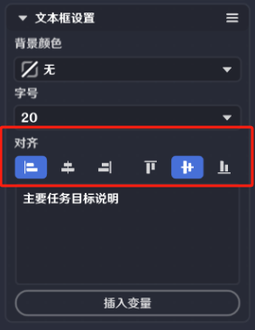
> `96ebbe9c-b116-49f2-a17a-42402b9f5e0b.png`：对齐设置栏，展示六个对齐图标。

> `b7445f40-62bd-4c55-b63c-a401ef13e1ef.png`：左侧对齐图标。

> `c5f27949-b4c5-44f8-92cc-98139b592462.png`：左侧对齐的文本示意。

> `8c285ce9-08c5-4f46-9663-03d47410b041.png`：水平居中图标。

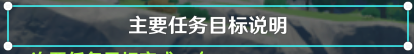
> `735d1b89-d226-4546-9223-ff13d9a7c7a2.png`：水平居中文本示意。

> `ae253126-b3b1-4261-8cf0-55be38763054.png`：右侧对齐图标。

> `a5a2ef4a-2436-49dd-92c5-03af02b20826.png`：右侧对齐文本示意。

> `39cd305c-2942-48eb-8fa9-7735129e2685.png`：顶部对齐图标。

> `f8815813-7167-4ad8-84a7-f69f53a9e203.png`：顶部对齐文本示意。

> `fbd7bd93-3e4d-4b66-9460-95fd43082df7.png`：垂直居中图标。

> `dfce3745-8c5a-4fe6-9f28-78a333dacaa2.png`：垂直居中文本示意。

> `f47554dc-7e0a-4d92-a232-cc3ba1cb0f21.png`：底部对齐图标。

> `8ef7b965-a246-4525-9d87-959cf68964c4.png`：底部对齐文本示意。

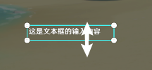
> `e37791ea-1dce-4cc2-aabc-2eb99c961446.png`：在画布拖动文本框边界，箭头表示可调整宽高。

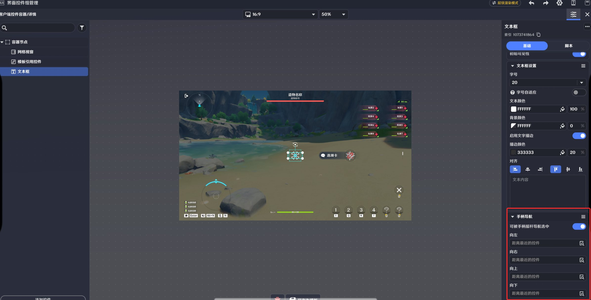
> `164c0217-944b-40ff-b4d6-9a2ea30be2be.jpg`：客户端文本框属性与手柄导航配置画面。

> `1b05f599-dc61-46bc-a853-387de23f9182.png`：手柄导航面板。

## 4. 文本视窗控件

官方页面：<https://act.mihoyo.com/ys/ugc/tutorial/detail/mhv38jig94kk>

功能与文本框一致，额外支持滚动；脚本接口名 `ClientUITextWindowControl`。需要先开启“是否可滚动”，才能编辑“显示滚动条”。

### 官方截图

> `9a7f5a1c-a248-4308-b893-66bd054633e4.png`：标题图，T 图标和“文本视窗”。

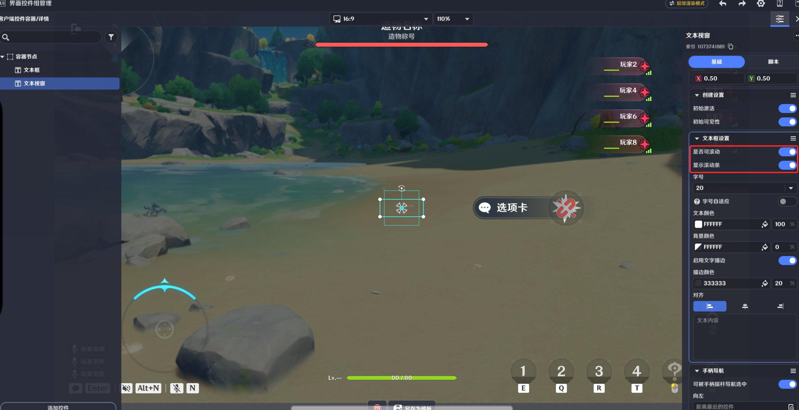
> `251899ef-ea54-4519-b0f4-7c5d945eda02.jpg`：文本视窗在画布中的完整配置画面，显示多行文字和右侧属性。

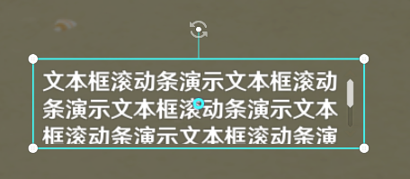
> `6b36bed7-d2aa-4750-ae5c-fa72ff2ea0f4.png`：画布中可滚动的多行文本示例。

> `9d9055c0-3091-407a-90cb-da7d3fab5829.png`：手柄导航面板。

## 5. 图片控件

官方页面：<https://act.mihoyo.com/ys/ugc/tutorial/detail/mh2oih9jou22>

图片可放在界面布局中并由节点图唤起；图片源支持静态引用、动态引用、道具、状态、技能、单位状态。静态引用可选素材、填充颜色和图片类型（基础/拉伸）；三宫格只在一个方向拉伸时保持四角，九宫格在两个方向拉伸时保持四角。客户端图片脚本接口名 `ClientUIImageControl`。遮罩支持父图裁切子图、边缘羽化（像素/百分比）、按进度填充（横向、纵向、90/180/360 度环绕）和遮罩区域反转。

### 官方截图

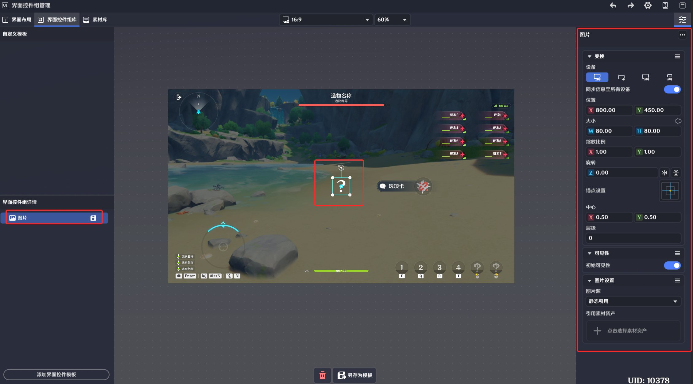
> `efe4f077-36ff-4639-98f0-df8583c450a8.jpg`：标题图，图片图标和“图片”。

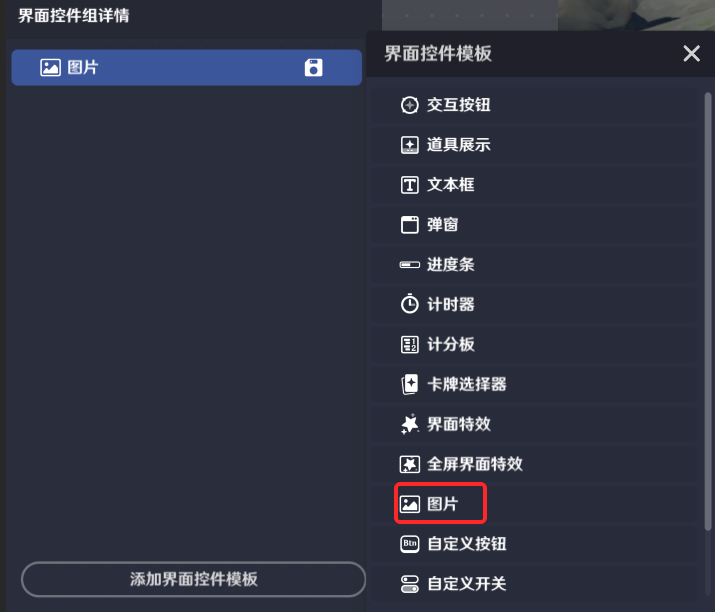
> `db9bd0a4-d658-4e99-bfb6-5fcd77dab95f.png`：添加图片后的界面布局/属性编辑器。

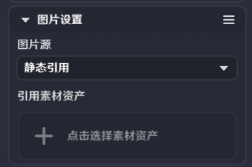
> `2cae5a53-4604-4c93-a625-d29b0f606efe.png`：图片源类型下拉/配置区域。

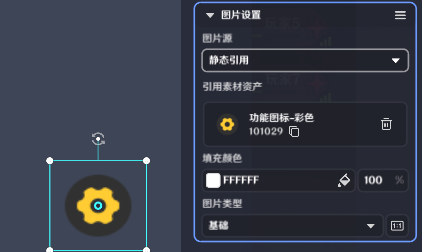
> `ea398b37-480e-4ba0-b0b9-be90bb1bf84b.png`：静态引用的素材选择界面。

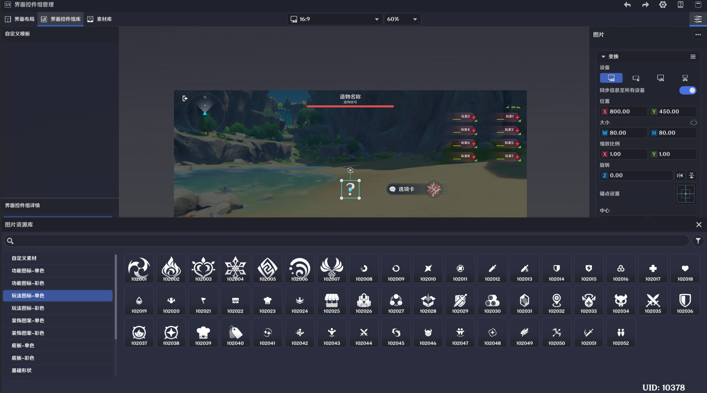
> `1c1d9706-a659-4824-bfd7-4b6afcbb2931.jpg`：填充颜色设置/颜色选择器。

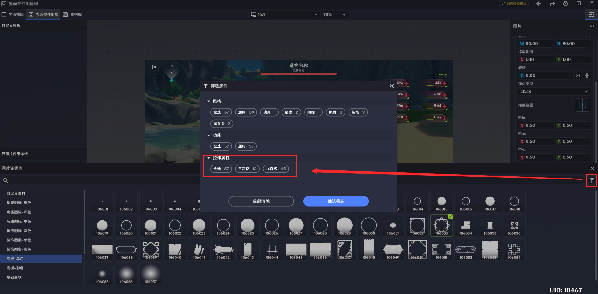
> `0998253a-1f58-4d09-9f16-569236f3e974.jpg`：普通、三宫格、九宫格图片类型及用途说明表。

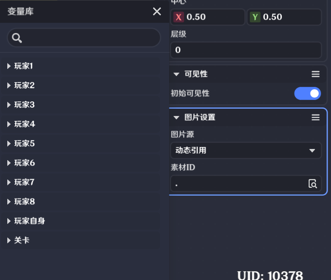
> `867f91fa-c984-4c6b-973d-4b96371bf69c.png`：其他图片源类型使用自定义变量作标识的配置。

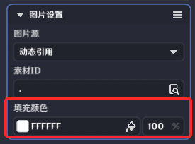
> `323156cf-c9f9-46f4-a45b-3a9e7398ad50.png`：客户端图片控件/遮罩功能入口示意。

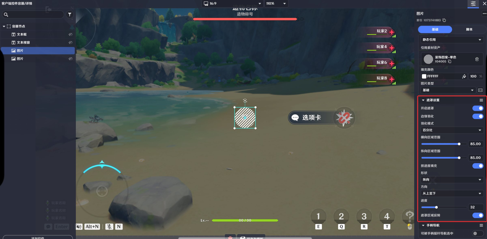
> `c0f1f884-5015-4d2b-b9e2-e1afac4c16c5.jpg`：父图片开启遮罩、子图片拖入父层级下的裁切步骤。

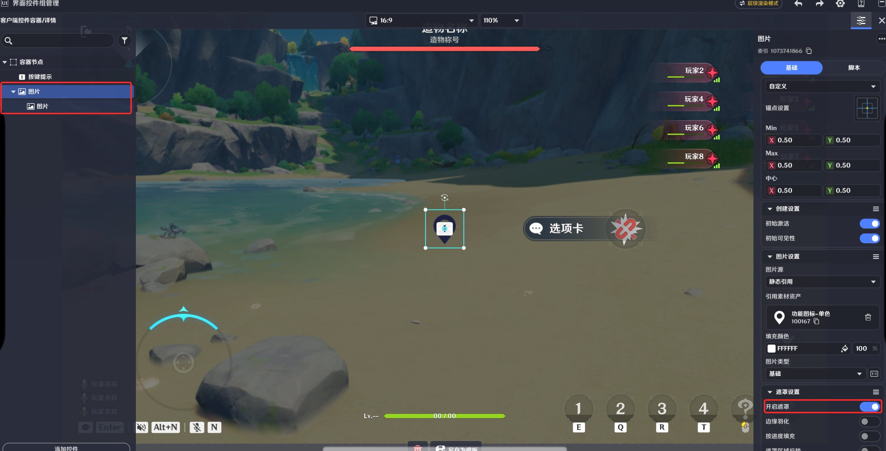
> `35b85a17-d159-4418-8599-8b6eb24303cb.jpg`：遮罩后的父子图片层级/效果示例。

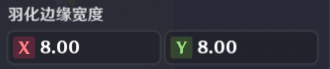
> `3b507972-4a49-4603-a800-08d7e7510798.png`：边缘羽化的“像素”模式参数。

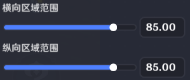
> `0fc18770-93f4-458d-92ac-abb1f71bb3de.png`：边缘羽化的“百分比”模式参数。

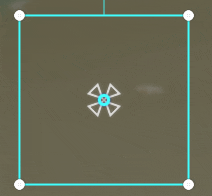
> `1fdf439f-5d16-496a-8d5e-2be78bcce319.gif`：横向进度填充动画示例。

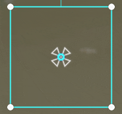
> `bb30f233-e2d7-49ff-9b4e-3a6503f9366d.gif`：纵向进度填充动画示例。

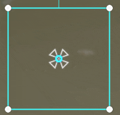
> `3a3d1c59-72f9-42a8-88ed-43e843a6fd29.gif`：90 度环绕填充动画示例。

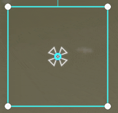
> `c7fc8fbd-fd37-48f5-b722-444c5f41734a.gif`：180 度环绕填充动画示例。

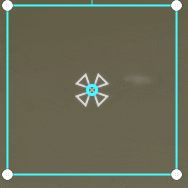
> `e3381806-1304-4bcb-b1c5-f3973852d43b.gif`：360 度环绕填充动画示例。

> `3c4e7fef-f8d1-43b9-a2b9-75bd7e85aadc.png`：手柄导航面板。

## 6. 界面动效控件

官方页面：<https://act.mihoyo.com/ys/ugc/tutorial/detail/mh2iyk9fa4gy>

界面动效在界面布局中显示特效资产，可由节点图播放；设置包含动效资产、是否播放自带音效、层级（所有控件之上/之下），右上角可开启不受层级限制的常驻预览。客户端脚本接口名 `ClientUIAnimationControl`。

### 官方截图

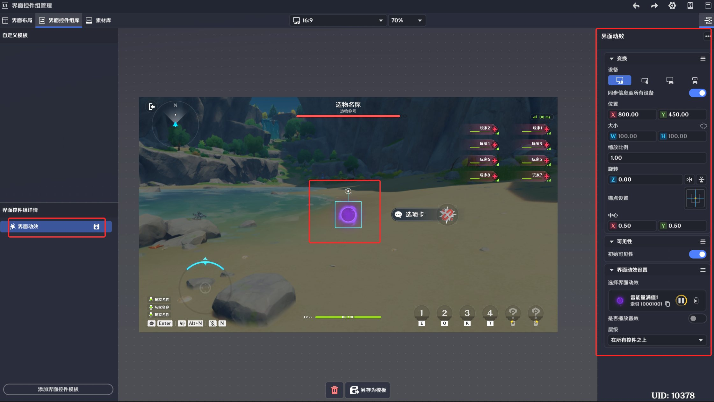
> `99670aae-7aa7-44c6-ad50-86a029ed25af.jpg`：画布中添加界面动效的编辑器。

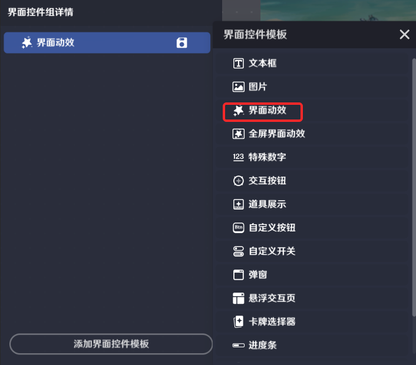
> `534cc6e9-55b1-4100-99d2-6486d40cc729.png`：控件模板库中选中“界面动效”。

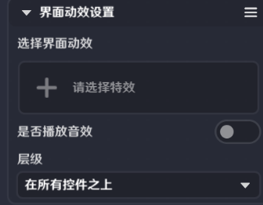
> `346044df-3026-40a5-90f4-69d9930e96a3.png`：界面动效设置，含“选择界面动效”“是否播放音效”“层级”。

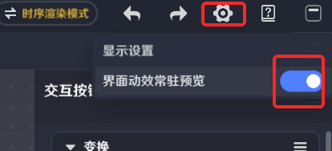
> `bc2e8fc6-fad4-43f1-9ab7-f457eab59251.png`：右上角设置中的“界面动效常驻预览”开关。

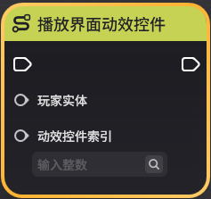
> `3b2f1a05-47ca-406d-ba31-65f2438ab738.png`：节点“播放界面动效控件”，参数含玩家实体和动效控件索引。

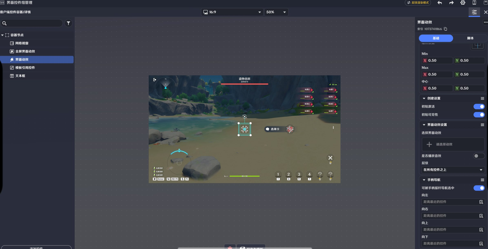
> `163e13d9-6bae-4bb6-b55d-5eee51c8b2a2.jpg`：客户端界面动效控件在画布及属性面板中的示例。

> `250d61d0-ecf3-4bcb-b71e-27d44e672ec9.png`：手柄导航面板。

## 7. 全屏界面动效控件

官方页面：<https://act.mihoyo.com/ys/ugc/tutorial/detail/mhbn4i09l5ns>

全屏动效默认在所有层级最下方且不可改，会覆盖整个屏幕，适合视野氛围效果；同样可由节点图播放。客户端脚本接口名 `ClientUIFullscreenAnimationControl`。

### 官方截图

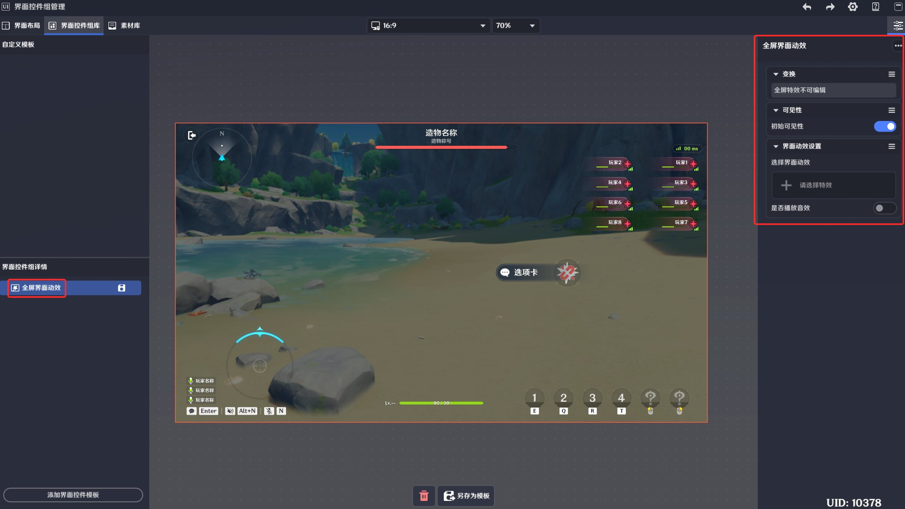
> `605431d0-f8e0-4cd0-9488-92a64cca39d9.jpg`：全屏动效画布编辑器。

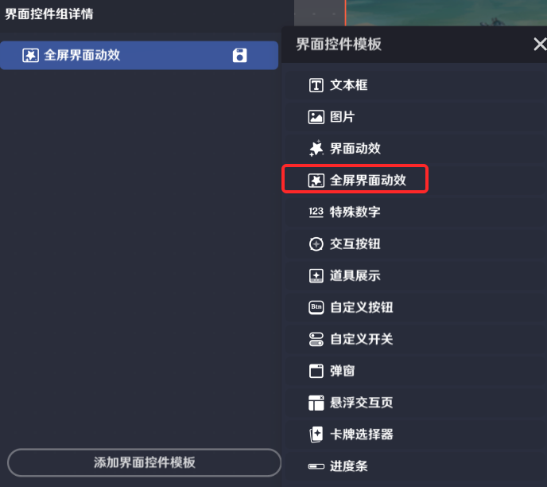
> `08f25508-442f-4e12-8046-30362e199055.png`：控件模板库中选中“全屏界面动效”。

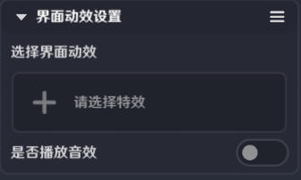
> `ade8bbca-ffb0-4edc-8ff7-25fc776d9455.png`：全屏动效设置，含特效选择和音效开关。

> `1cd159a8-28a7-4e60-b31d-b31a1111a041.png`：节点“播放界面动效控件”。

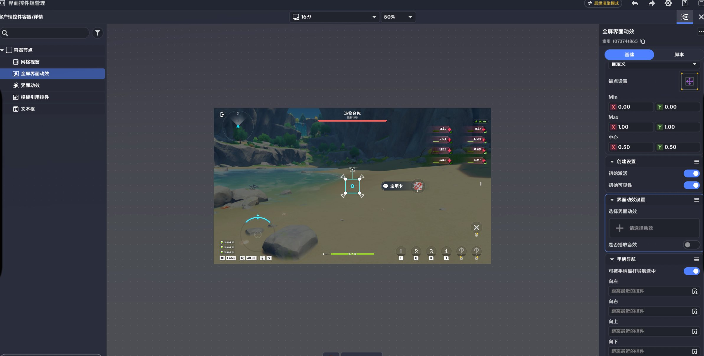
> `4b8a266a-115d-41c5-a490-0cc520228e2d.jpg`：客户端全屏动效控件示例。

> `2952d2c5-e68c-4016-b2c3-ac74b5bd5572.png`：手柄导航面板。

## 8. 预设按钮控件

官方页面：<https://act.mihoyo.com/ys/ugc/tutorial/detail/mhdbkf04v6y8>

预设按钮可配置默认、悬停、按下、不可用四种状态的图标和文本，状态外显样式来自子层级客户端控件；脚本接口名 `ClientUIPresetButtonControl`。配置有光标射线检测、按钮可用、状态节点、按下音效和手柄导航。

### 官方截图

> `458bd155-e929-4fe6-9427-63e1472021e4.png`：标题图，Btn 图标和“预设按钮”。

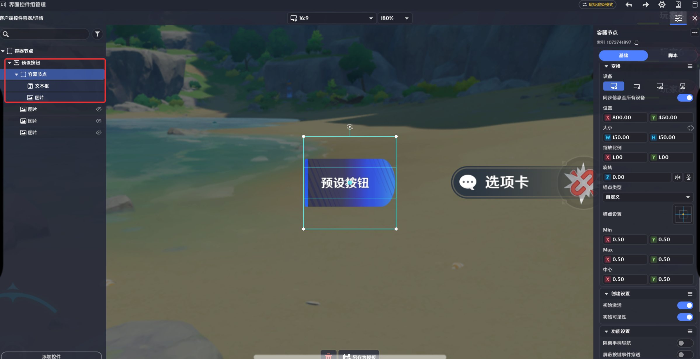
> `b642630f-1653-4dac-9dc9-dec350d43b86.jpg`：在编辑器中拖动/添加子控件到预设按钮的状态区域。

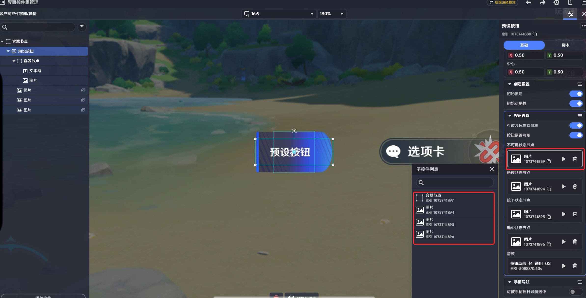
> `8e8e1626-482d-440c-9ff5-cb0bfbe5d7d6.jpg`：点击状态节点后，从子控件列表选择引用对象。

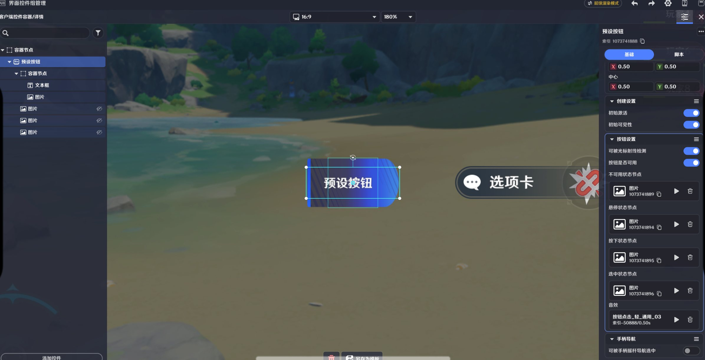
> `2e78e971-b81f-4679-b907-1f1c5c76a986.jpg`：按钮设置面板，含射线检测、可用开关、四种状态节点和播放预览。

> `1001f025-c3ff-4074-b3da-6d509d22ddb0.png`：按下交互音效配置。

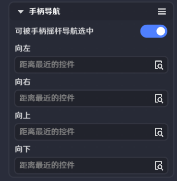
> `f05a5f2e-73a7-4fa7-bf69-bd34b94d5877.png`：手柄导航面板。

## 9. 按键提示

官方页面：<https://act.mihoyo.com/ys/ugc/tutorial/detail/mh265urgupye>

封装快捷键提示，支持 PC、键鼠和手柄；脚本接口名 `ClientUIKeyHintControl`。设置用于配置快捷键显示，手柄导航用于设置四向移动时的控件。

### 官方截图

> `5e517362-9ef8-45e9-9db9-87b5857d917a.png`：标题图，数字 1 图标和“按键提示”。

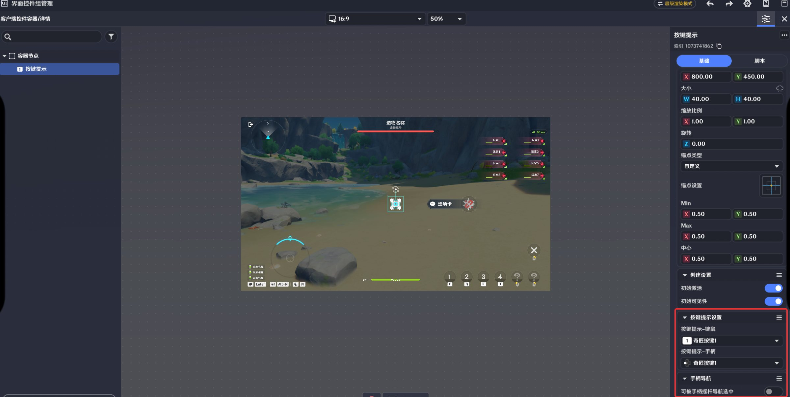
> `f0805ebc-4a38-4e4a-8230-921af445e962.jpg`：按键提示属性/画布示例。

> `778d9b82-3d9e-4bc4-a279-12e9111a5049.png`：手柄导航面板。

## 10. 光标检测区域控件

官方页面：<https://act.mihoyo.com/ys/ugc/tutorial/detail/mhd4fxr5v6la>

接收光标射线事件，可与图片、文本框组成基础按钮；脚本接口名 `ClientUICursorEventAreaControl`。配置为“范围常驻预览”和“可被光标射线检测”，并可设置手柄导航。

### 官方截图

> `1c0f9325-bc2a-4ba6-a3ee-cb9e6075bc57.png`：标题图，鼠标指针图标和“光标检测区域”。

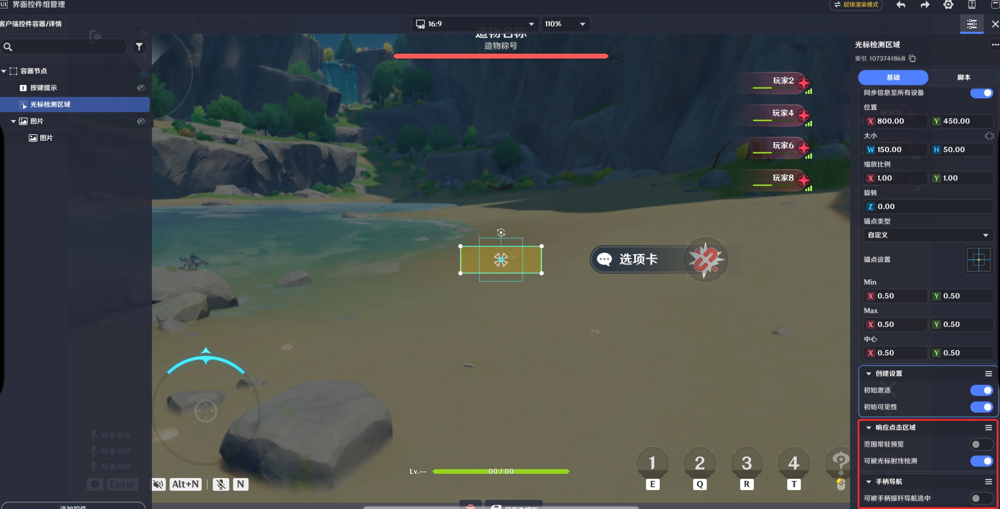
> `c8246ae2-6a5b-448e-9e6c-d144a1ea094b.jpg`：画布中的检测区域及属性面板，显示预览色块、射线检测开关。

> `4e7a70c4-037c-42dc-8970-c2801fc2d845.png`：手柄导航面板。

## 11. 网格视窗

官方页面：<https://act.mihoyo.com/ys/ugc/tutorial/detail/mhfkrr0i7gds>

网格视窗是可复用列表，适合背包和商品列表；为性能只加载可见项，滚动时刷新列表项内容，可用 `RefreshItems`。脚本接口名 `ClientUIGridScrollerControl`。配置有射线检测、可滚动、滚动条、方向、项大小、边距、自动换行/固定行数、列表项模板和手柄导航。

### 官方截图

> `f2620042-03a9-4098-acac-bb3e03235040.png`：标题图，网格图标和“网格视窗”。

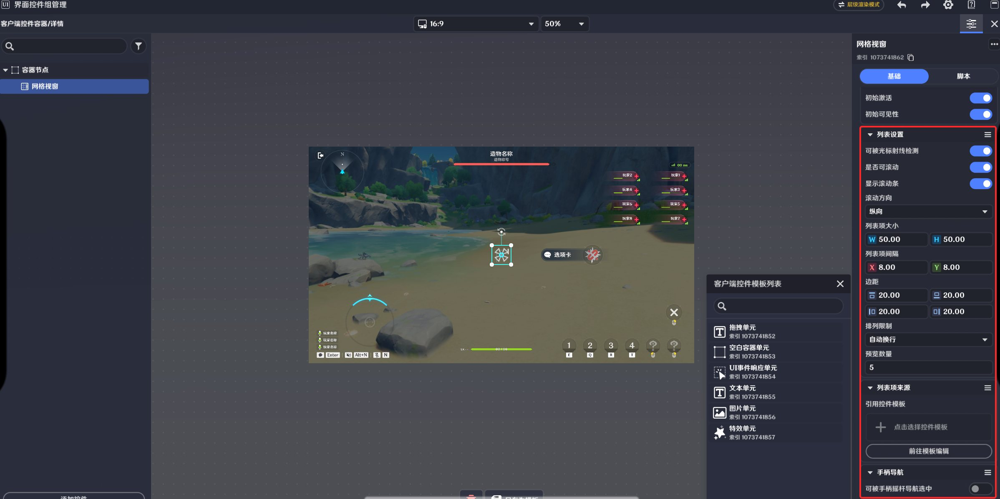
> `f5a9af0f-3748-42f8-9285-15f181e674c8.jpg`：网格视窗列表设置面板，含滚动、方向、项大小、边距、排列限制和预览数量。

> `1e05de66-429f-4d30-a653-454760d47ffa.png`：手柄导航面板及列表项导航规则。

## 12. 模板引用控件

官方页面：<https://act.mihoyo.com/ys/ugc/tutorial/detail/mhucb6reudwm>

模板引用控件可引用已保存的其他客户端控件模板并预览；运行时表现与被引用模板一致。脚本接口名 `ClientUIReferenceControl`，配置字段为“引用控件模板”和手柄导航。

### 官方截图

> `95d5ac2d-6e5b-4947-8ce6-bca6319080ac.png`：标题图，链条图标和“模板引用控件”。

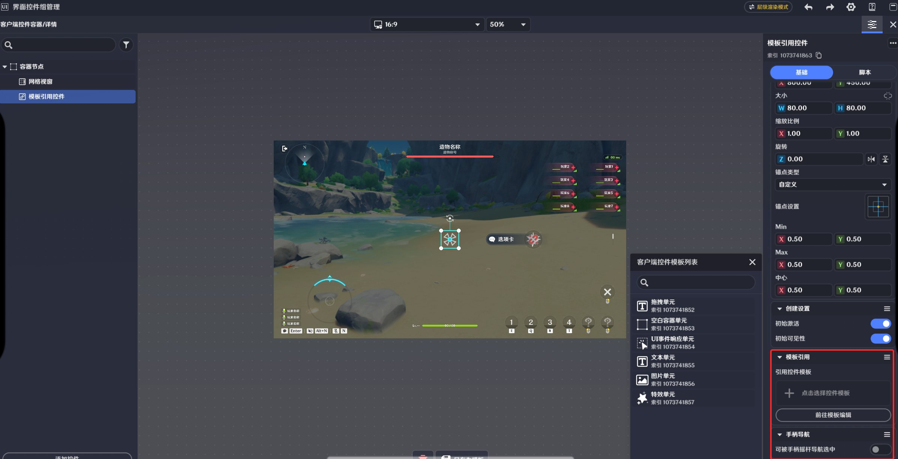
> `01540211-427b-46cf-8263-ff67471e6125.jpg`：模板引用配置，含引用控件模板选择。

> `b56890f6-7c03-4ab2-b4d2-6502f09d1344.png`：手柄导航面板。

