# 视频逐页图册

本图册供创作者阅读。每页截图保留原始 852×480 画面，代码图不放在表格中。图片只作教学证据；编写正式代码时仍以本包 API 文档为准。

## 来源与使用边界

作者：**和裕茶客**。两份视频内容均来自**原神 7.1 创作者体验服**，画面声明实际内容以正式上线为准。截图保留原画面标题、页码与声明；不改署名，不把视频演示归为本包原创。

[动画教程原视频](https://www.bilibili.com/video/BV1DieU6rEiQ/) · [控件与脚本简介原视频](https://www.bilibili.com/video/BV1dqeF62EbP/)

时间点是截图采样时刻，格式为分:秒，**不是页面开始时间**。原工作文件名中的 `v2_52` 表示第二视频第 52 秒。字幕与翻页可能不同步，所以按左上标题和右上页码判断内容。示例中的 ID、坐标、时长、颜色均不是你的项目默认值。

动画教程已按 **01/44 至 44/44** 全覆盖；精确文件、秒数、标题和校验值见 [manifest.json](assets/video2-all/manifest.json)，便于手动浏览的清单见 [manifest.csv](assets/video2-all/manifest.csv)。截图只用于本包教学与来源核对，不据此宣称获得再次公开分发授权。

## 视频二：44 页动画教程

### 01/44 · 补间动画是什么

[00:35 · 原视频对应时间](https://www.bilibili.com/video/BV1DieU6rEiQ/?t=35)。对象、目标状态、持续时间决定一次补间；中间帧由运行时插值。

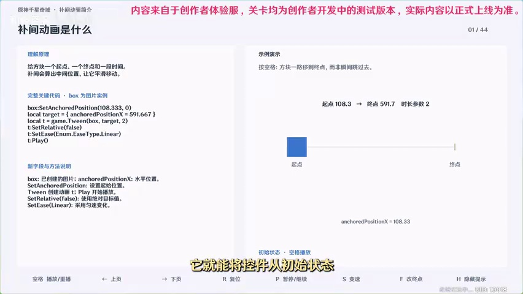

### 02/44 · 先准备容器与脚本

[00:52 · 原视频对应时间](https://www.bilibili.com/video/BV1DieU6rEiQ/?t=52)。流程页与 OnStart/script.object；它不是 Tween 创建页。

### 03/44 · 从模板创建图片

[01:00 · 原视频对应时间](https://www.bilibili.com/video/BV1DieU6rEiQ/?t=60)。实例化返回 box；SetImage 的资产 ID 与模板索引不同。

### 04/44 · 读懂一次 API 调用

[01:30 · 原视频对应时间](https://www.bilibili.com/video/BV1DieU6rEiQ/?t=90)。game.Tween(box, target, duration) 返回动画对象；目标键必须是 Tweenable。

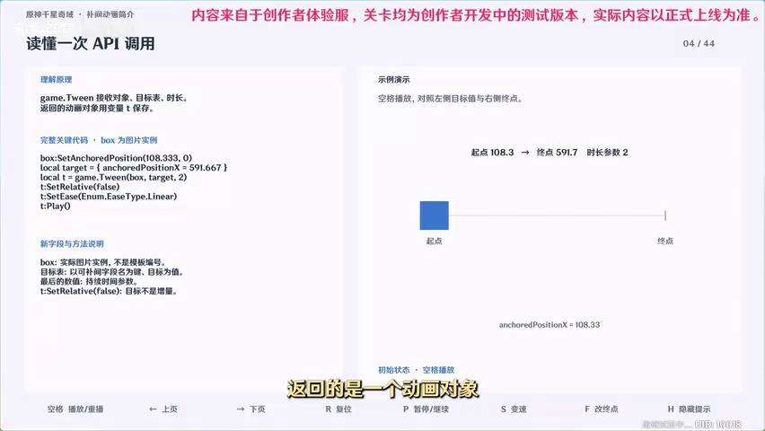

### 05/44 · 先设置，再创建，最后播放

[01:52 · 原视频对应时间](https://www.bilibili.com/video/BV1DieU6rEiQ/?t=112)。先设置起点，再创建和配置 Tween，最后 Play；点号与冒号不可混用。

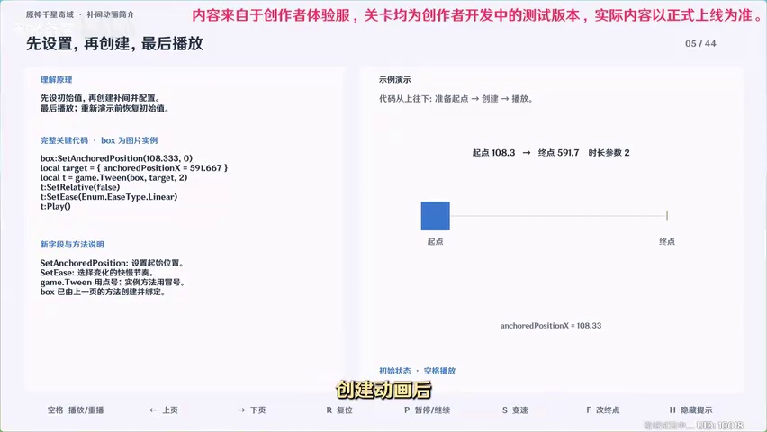

### 06/44 · 水平移动

[02:15 · 原视频对应时间](https://www.bilibili.com/video/BV1DieU6rEiQ/?t=135)。anchoredPositionX 是终点坐标；时长改变速度，终点改变路程。

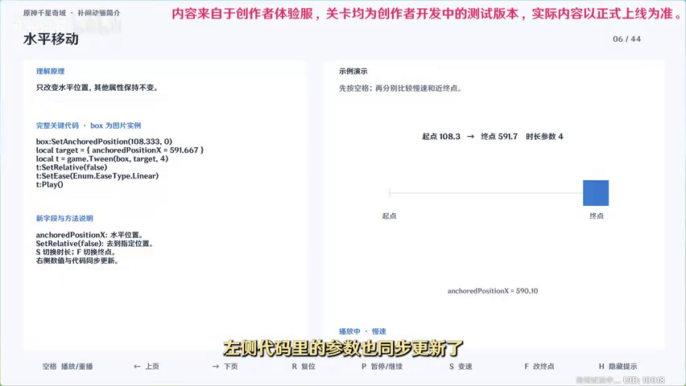

### 07/44 · 垂直移动

[02:24 · 原视频对应时间](https://www.bilibili.com/video/BV1DieU6rEiQ/?t=144)。仅改变 anchoredPositionY。

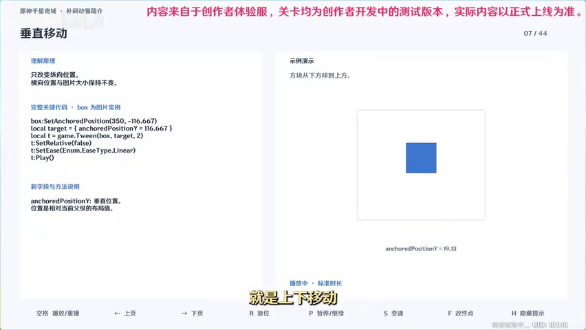

### 08/44 · 斜向移动

[02:27 · 原视频对应时间](https://www.bilibili.com/video/BV1DieU6rEiQ/?t=147)。同一目标表同时设置 anchoredPositionX/Y。

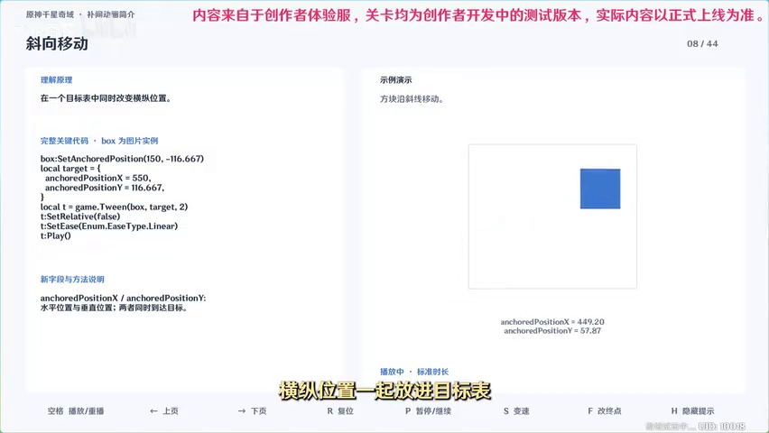

### 09/44 · 等比缩放

[02:34 · 原视频对应时间](https://www.bilibili.com/video/BV1DieU6rEiQ/?t=154)。localScaleX/Y 使用相同比例。

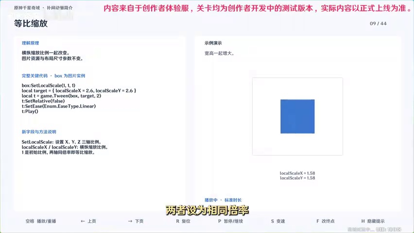

### 10/44 · 横向缩放

[02:38 · 原视频对应时间](https://www.bilibili.com/video/BV1DieU6rEiQ/?t=158)。只改变 localScaleX，纵向比例不变。

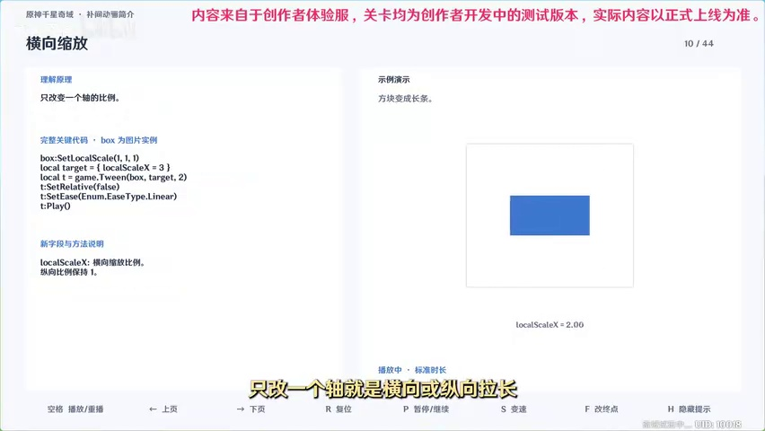

### 11/44 · 纵向缩放

[02:40 · 原视频对应时间](https://www.bilibili.com/video/BV1DieU6rEiQ/?t=160)。只改变 localScaleY，横向比例不变。

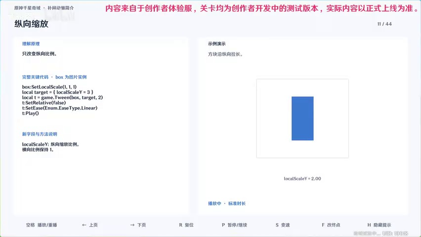

### 12/44 · Z 轴缩放

[02:43 · 原视频对应时间](https://www.bilibili.com/video/BV1DieU6rEiQ/?t=163)。localScaleZ 数值会变；平面图片外观可能不明显。

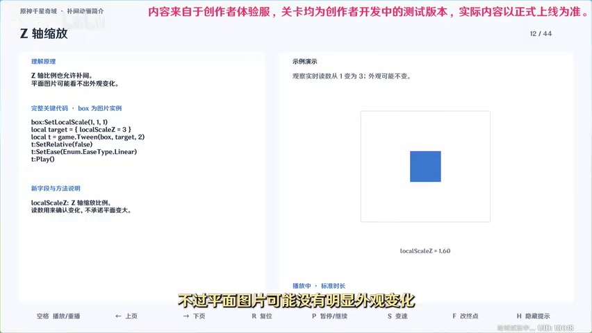

### 13/44 · 宽度变化

[02:50 · 原视频对应时间](https://www.bilibili.com/video/BV1DieU6rEiQ/?t=170)。sizeDeltaX 改布局尺寸；本页固定最小/最大锚点。

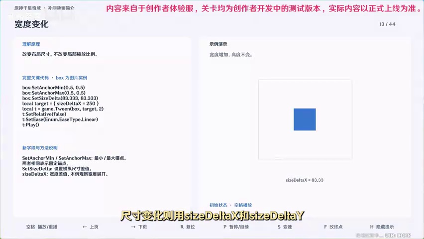

### 14/44 · 高度变化

[02:54 · 原视频对应时间](https://www.bilibili.com/video/BV1DieU6rEiQ/?t=174)。sizeDeltaY 改布局尺寸，与缩放倍率分开理解。

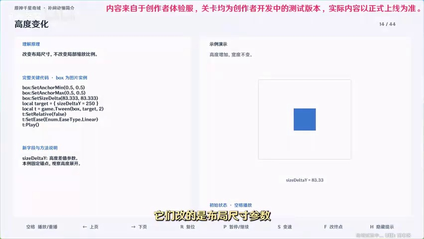

### 15/44 · Z 轴旋转

[03:00 · 原视频对应时间](https://www.bilibili.com/video/BV1DieU6rEiQ/?t=180)。SetPivot 决定基准；localRotationZ 改平面转角。

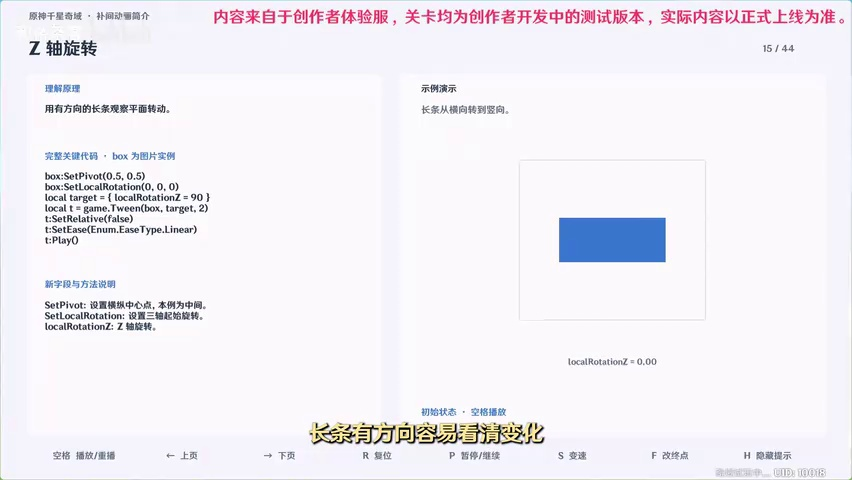

### 16/44 · X 轴旋转

[03:06 · 原视频对应时间](https://www.bilibili.com/video/BV1DieU6rEiQ/?t=186)。localRotationX 改 X 轴旋转；投影依赖 UI 表现。

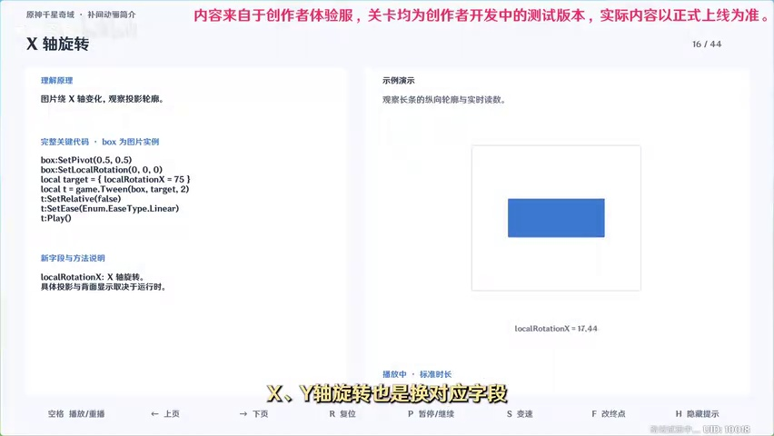

### 17/44 · Y 轴旋转

[03:09 · 原视频对应时间](https://www.bilibili.com/video/BV1DieU6rEiQ/?t=189)。localRotationY 改 Y 轴旋转；不要概括成确定的镜像效果。

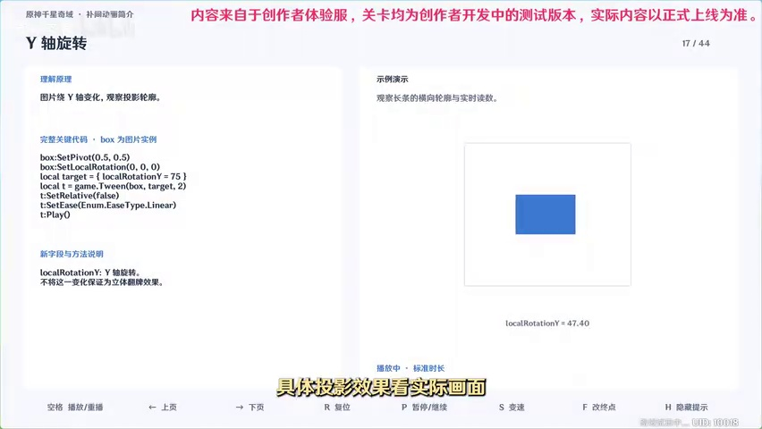

### 18/44 · 图片变色

[03:14 · 原视频对应时间](https://www.bilibili.com/video/BV1DieU6rEiQ/?t=194)。imageColor 用 RGBA 颜色；四通道范围 0–255。

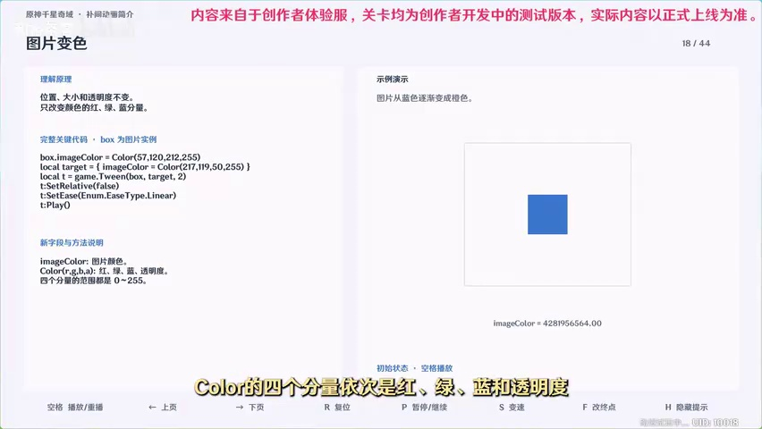

### 19/44 · 图片淡出

[03:21 · 原视频对应时间](https://www.bilibili.com/video/BV1DieU6rEiQ/?t=201)。仅把 imageColor 的 alpha 降到 0；这不是最小锚点页。

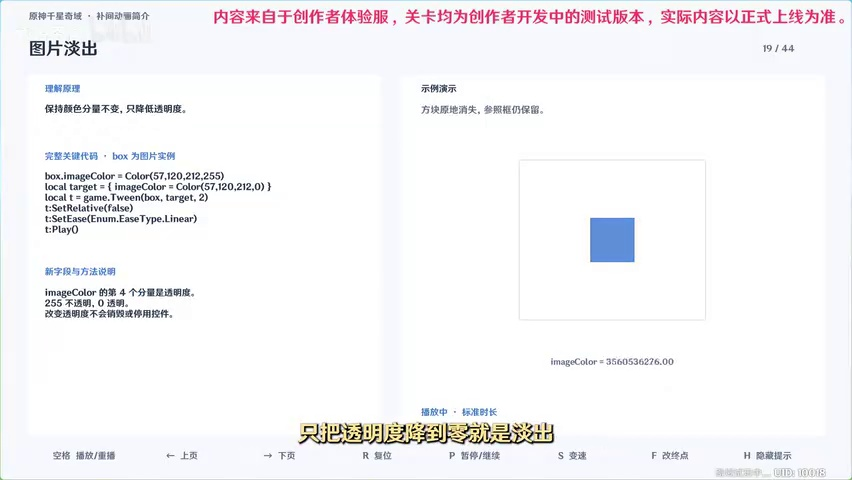

### 20/44 · 图片淡入

[03:24 · 原视频对应时间](https://www.bilibili.com/video/BV1DieU6rEiQ/?t=204)。把 alpha 从 0 提高到 255。

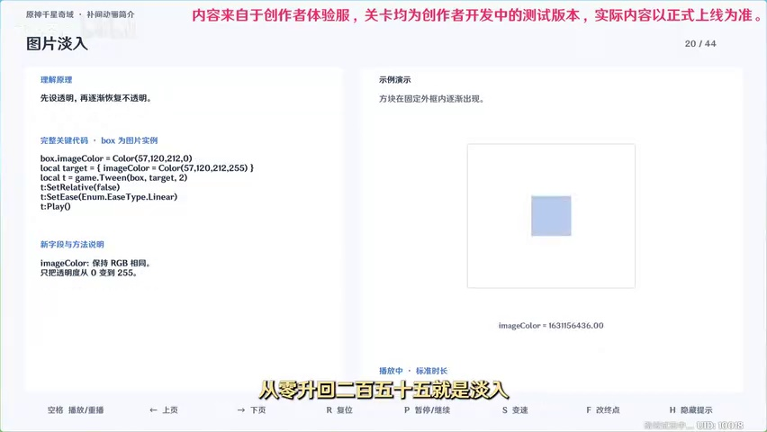

### 21/44 · 水平填充

[03:36 · 原视频对应时间](https://www.bilibili.com/video/BV1DieU6rEiQ/?t=216)。enableMask 与填充方向先配置，再 Tween fillAmount。

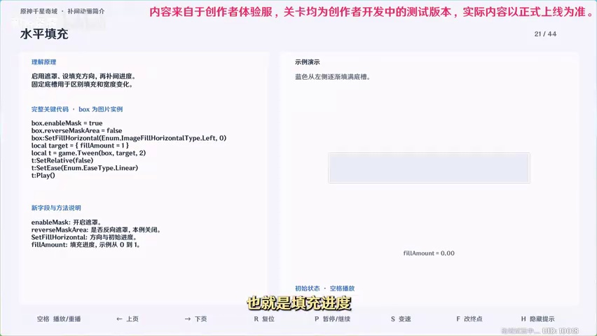

### 22/44 · 垂直填充

[03:44 · 原视频对应时间](https://www.bilibili.com/video/BV1DieU6rEiQ/?t=224)。SetFillVertical 选择垂直方向，补间目标仍为 fillAmount。

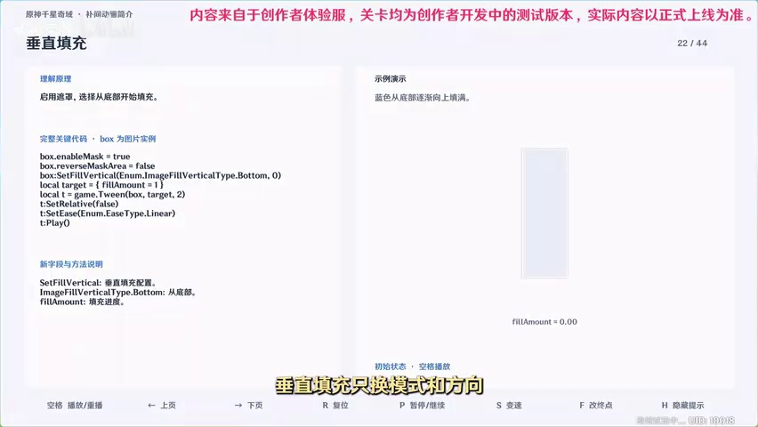

### 23/44 · 90 度环绕填充

[03:49 · 原视频对应时间](https://www.bilibili.com/video/BV1DieU6rEiQ/?t=229)。SetFillRadial90 使用 ImageFillRadial90Type，例子从 BottomLeft 开始。

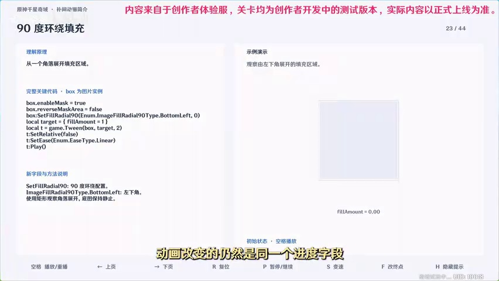

### 24/44 · 180 度环绕填充

[03:54 · 原视频对应时间](https://www.bilibili.com/video/BV1DieU6rEiQ/?t=234)。SetFillRadial180 使用 ImageFillRadialType，例子从 Bottom 开始。

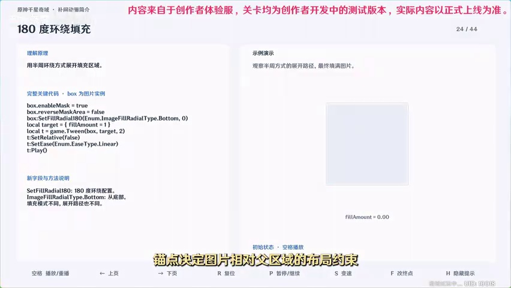

### 25/44 · 360 度环绕填充

[03:59 · 原视频对应时间](https://www.bilibili.com/video/BV1DieU6rEiQ/?t=239)。SetFillRadial360 使用 ImageFillRadialType，例子从 Top 开始。

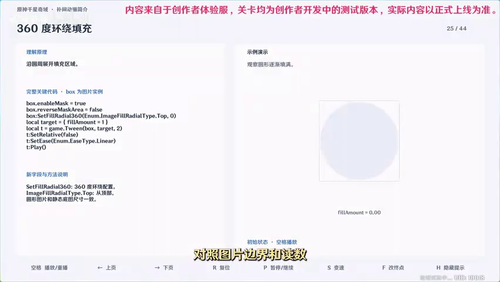

### 26/44 · 最小锚点 X

[04:02 · 原视频对应时间](https://www.bilibili.com/video/BV1DieU6rEiQ/?t=242)。anchorMinX：最小锚点的横分量。

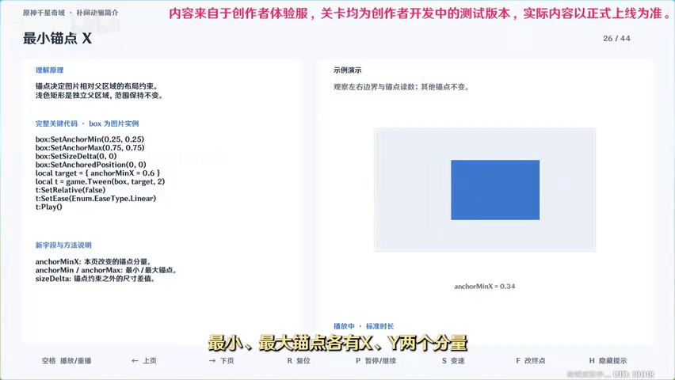

### 27/44 · 最小锚点 Y

[04:04 · 原视频对应时间](https://www.bilibili.com/video/BV1DieU6rEiQ/?t=244)。anchorMinY：最小锚点的纵分量。

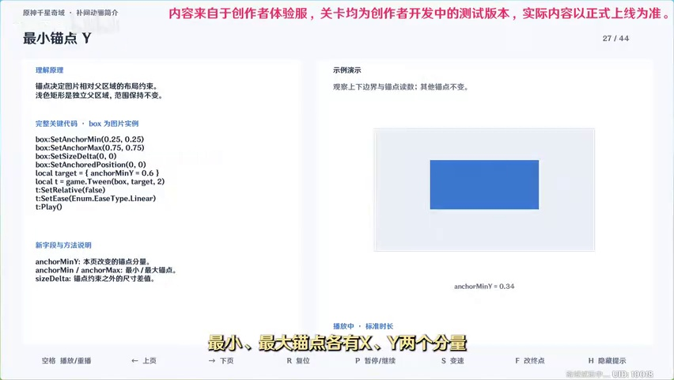

### 28/44 · 最大锚点 X

[04:06 · 原视频对应时间](https://www.bilibili.com/video/BV1DieU6rEiQ/?t=246)。anchorMaxX：最大锚点的横分量。

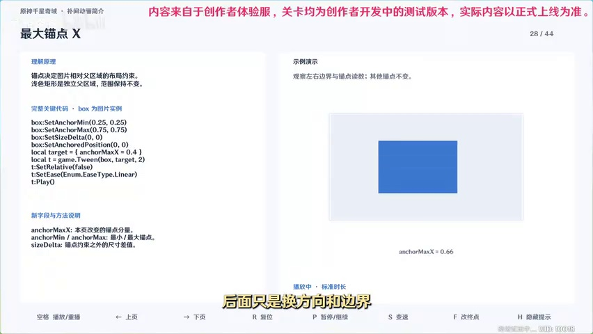

### 29/44 · 最大锚点 Y

[04:08 · 原视频对应时间](https://www.bilibili.com/video/BV1DieU6rEiQ/?t=248)。anchorMaxY：最大锚点的纵分量。

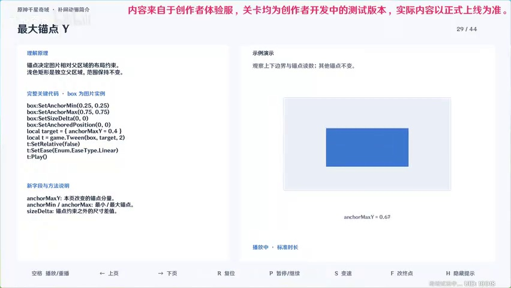

### 30/44 · 中心点 X

[04:12 · 原视频对应时间](https://www.bilibili.com/video/BV1DieU6rEiQ/?t=252)。pivotX：横向中心点；固定十字辅助观察。

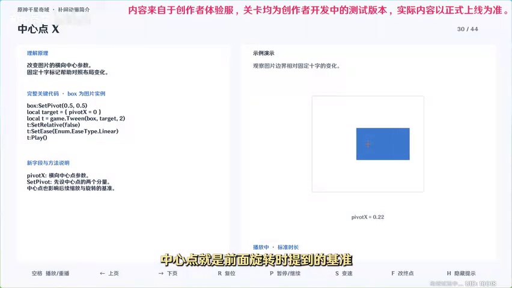

### 31/44 · 中心点 Y

[04:15 · 原视频对应时间](https://www.bilibili.com/video/BV1DieU6rEiQ/?t=255)。pivotY：纵向中心点；不是 anchoredPositionY。

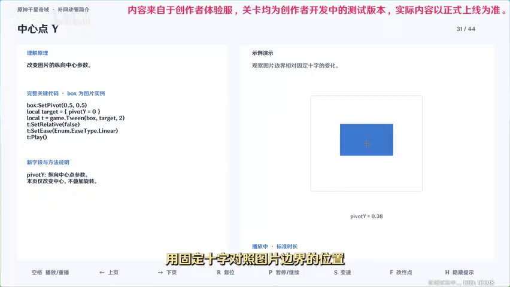

### 32/44 · 水平羽化宽度

[04:20 · 原视频对应时间](https://www.bilibili.com/video/BV1DieU6rEiQ/?t=260)。开启遮罩/羽化；画面使用 Pixel，Tween softEdgeWidthX。

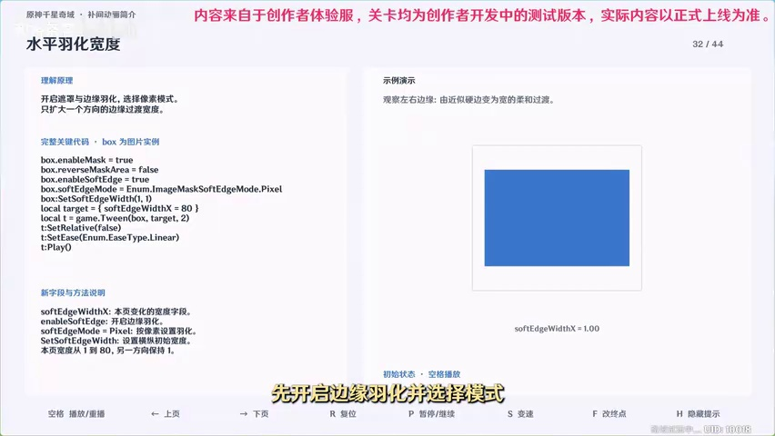

### 33/44 · 垂直羽化宽度

[04:26 · 原视频对应时间](https://www.bilibili.com/video/BV1DieU6rEiQ/?t=266)。开启遮罩/羽化；画面使用 Pixel，Tween softEdgeWidthY。

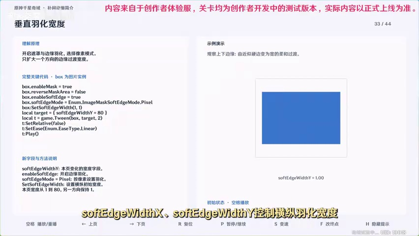

### 34/44 · 水平羽化范围

[04:34 · 原视频对应时间](https://www.bilibili.com/video/BV1DieU6rEiQ/?t=274)。画面使用 Percentage，Tween horizontalSoftRange。

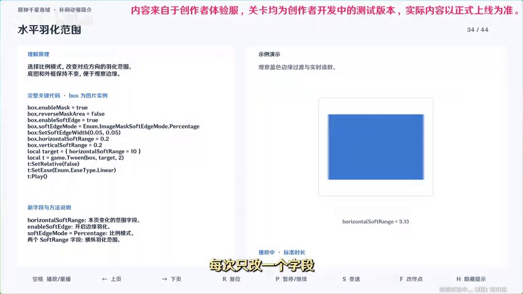

### 35/44 · 垂直羽化范围

[04:38 · 原视频对应时间](https://www.bilibili.com/video/BV1DieU6rEiQ/?t=278)。画面使用 Percentage，Tween verticalSoftRange。

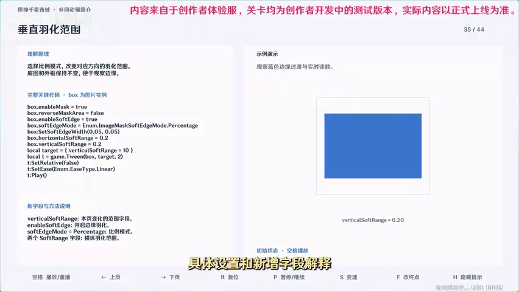

### 36/44 · 线性与缓动

[04:46 · 原视频对应时间](https://www.bilibili.com/video/BV1DieU6rEiQ/?t=286)。相同起点、终点和时长；Linear 与 InQuad 的中途位置不同。

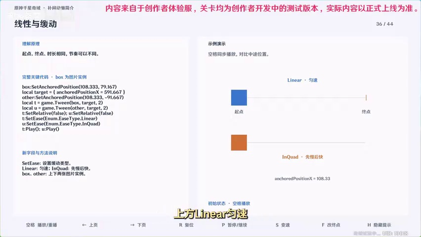

### 37/44 · 同时变化

[04:53 · 原视频对应时间](https://www.bilibili.com/video/BV1DieU6rEiQ/?t=293)。一个目标表同时含位移与缩放，各字段同一时段变化。

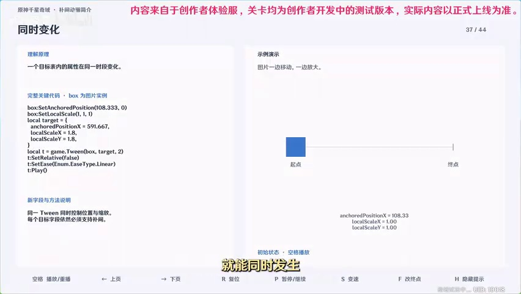

### 38/44 · 先后变化

[05:00 · 原视频对应时间](https://www.bilibili.com/video/BV1DieU6rEiQ/?t=300)。分别创建 move/grow，序列 Append 两次，最后播放序列。

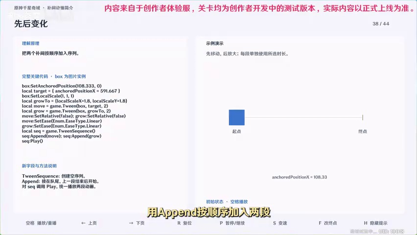

### 39/44 · 全部缓动类型 · 1 / 2

[05:10 · 原视频对应时间](https://www.bilibili.com/video/BV1DieU6rEiQ/?t=310)。Linear 及 Sine/Quad/Cubic/Quart/Quint 的 In/Out/InOut。

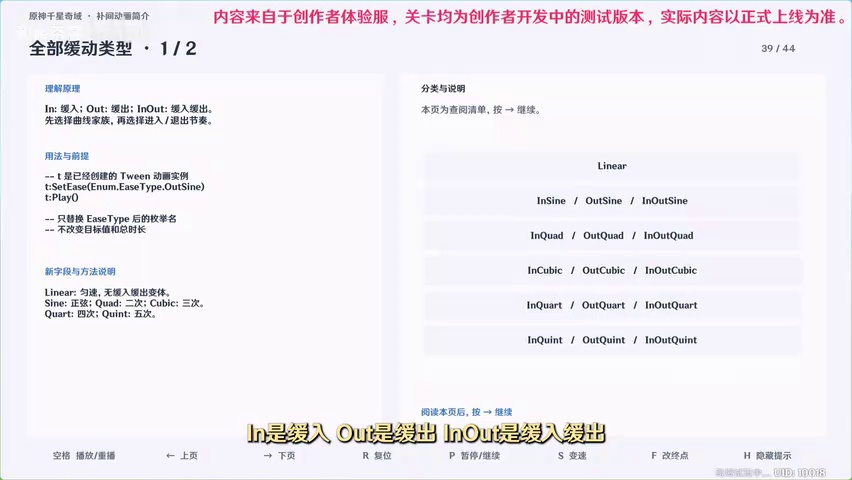

### 40/44 · 全部缓动类型 · 2 / 2

[05:17 · 原视频对应时间](https://www.bilibili.com/video/BV1DieU6rEiQ/?t=317)。Expo/Circ/Back/Elastic/Bounce 的 In/Out/InOut；回弹和弹性可越界。

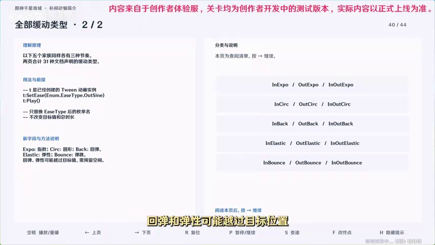

### 41/44 · 可补间字段 · 所有控件共有

[05:24 · 原视频对应时间](https://www.bilibili.com/video/BV1DieU6rEiQ/?t=324)。16 个共有字段，完整拼写仍查当前 API。

### 42/44 · 可补间字段 · 图片控件

[05:30 · 原视频对应时间](https://www.bilibili.com/video/BV1DieU6rEiQ/?t=330)。图片另有 imageColor、fillAmount、两项宽度、两项范围。

### 43/44 · 可补间字段 · 文字与网格视窗

[05:34 · 原视频对应时间](https://www.bilibili.com/video/BV1DieU6rEiQ/?t=334)。文字另有字号/颜色等 5 项，网格视窗另有 scrollProgress。

### 44/44 · 可补间字段 · 其余控件

[05:38 · 原视频对应时间](https://www.bilibili.com/video/BV1DieU6rEiQ/?t=338)。其他七类控件列出共有字段；不表示任何可赋值字段都可补间。

## 视频一：控件与脚本简介精选

以下 6 张帮助把控件、动画和状态联系起来；第一视频未展示所有实现源码。

### 容器节点

[00:30 · 原视频对应时间](https://www.bilibili.com/video/BV1dqeF62EbP/?t=30)。组织父子关系，一组元素整体移动。

### 模板引用控件

[02:06 · 原视频对应时间](https://www.bilibili.com/video/BV1dqeF62EbP/?t=126)。复用已配置的设计，不等于运行时改模板。

### 补间动画

[02:58 · 原视频对应时间](https://www.bilibili.com/video/BV1dqeF62EbP/?t=178)。对比匀速、缓入缓出和弹跳节奏。

### 动画序列

[03:13 · 原视频对应时间](https://www.bilibili.com/video/BV1dqeF62EbP/?t=193)。先后、并行、等待、定时回调组成演出。

### 逐帧逻辑与本地状态

[03:24 · 原视频对应时间](https://www.bilibili.com/video/BV1dqeF62EbP/?t=204)。持续更新与启停清理；不是一次性 Tween 的必要前提。

### 信号与自定义变量

[04:07 · 原视频对应时间](https://www.bilibili.com/video/BV1dqeF62EbP/?t=247)。本次演示为本地示意，不证明服务器同步已实现。

